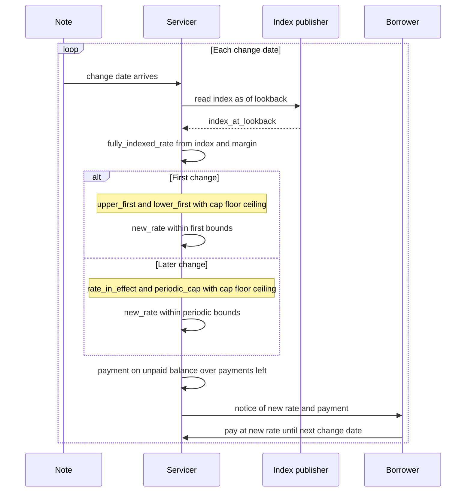

# ARM loan concepts

This skill explains how a fixed-then-adjusting adjustable-rate mortgage changes its note rate at scheduled change dates and how the servicer sets the payment afterward. It is for concept questions: what the terms mean and how the steps fit together. It does not compute a payment, an interest total, a reset rate for anyone's loan, or an index value, and it does not run any script.

## Parameters

- **start rate** (`start_rate`): the note rate charged through the fixed period; the rate the lifetime ceiling is measured from.
- **term** (`term_payments`): the number of monthly payments to maturity; an ARM is amortized over the same term as a fixed loan.
- **initial fixed period** (`fixed_payments`): the payments at the start rate before the first change date.
- **adjustment interval** (`adjust_interval`): the payments between one change date and the next, so each later change is `adjust_interval` payments after the last; a note that adjusts annually has an interval of 12.
- **index**: the published benchmark the note names; its reading enters the fully indexed rate.
- **lookback**: the number of days before a change date as of which the index is read (`index_at_lookback`).
- **margin** (`margin`): the fixed amount the note adds to the index.
- **initial cap** (`initial_cap`): how far above the start rate the first change may set the rate; the first change's lower bound is the initial floor, not `start_rate - initial_cap`.
- **periodic cap** (`periodic_cap`): how far any later change may move the rate from the rate then in effect.
- **lifetime cap** (`lifetime_cap`): how far above the start rate the rate may ever be; the ceiling is `start_rate + lifetime_cap`.
- **initial floor** (`initial_floor`): the lowest rate the first change may set.
- **lifetime floor** (`lifetime_floor`): the lowest rate any later change may set.

When a person states only one floor, treat it as both the initial floor and the lifetime floor. A note which instead limits the first decrease by the initial cap has an initial floor of `start_rate - initial_cap`.

## Procedure

The note sets the **change dates**. The first is the payment after the fixed period, `first_change = fixed_payments + 1`, and each later one is `adjust_interval` payments after the last. A month that is **not a change date** keeps the rate then in effect. An index reading for one month does not change a month that is not a change date; only `index_at_lookback` before a change date enters a rate.

On a **change date** the servicer reads the index as of the **lookback**, adds the margin, and that sum is the fully indexed rate: `fully_indexed_rate = index_at_lookback + margin`. A **higher margin** lifts every future fully indexed rate, because the margin is a term of `fully_indexed_rate` at every change date. If the note rounds that sum (uniform notes round to the nearest one-eighth of one percentage point), the value that enters `new_rate` below is the **rounded sum**; the caps, the floors, and the ceiling are **not rounded**. The skill does not give a tie rule.

The ceiling is `lifetime_ceiling = start_rate + lifetime_cap`. A lifetime ceiling defined as `start_rate + lifetime_cap` **moves with the start rate**: a lower start rate is a lower ceiling.

The **first change** is bounded by the initial cap and the initial floor, and by the ceiling. The **lifetime floor does not enter the first change**; the initial floor is its lower bound: `upper_first = min(start_rate + initial_cap, lifetime_ceiling)`, `lower_first = initial_floor`, and `new_rate = max(min(fully_indexed_rate, upper_first), lower_first)`.

After that, the **periodic cap** bounds the move from the rate just before that change, `rate_in_effect`, not `start_rate`, in both directions, and the lifetime ceiling and floor bound every later rate: `upper = min(rate_in_effect + periodic_cap, lifetime_ceiling)`, `lower = max(rate_in_effect - periodic_cap, lifetime_floor)`, and `new_rate = max(min(fully_indexed_rate, upper), lower)`.

When there is **no index** given for a change date, the target in place of `fully_indexed_rate` is that change's **upper bound**, and that target is not rounded. The skill does not state the rate that produces.

The rate charged is applied to the unpaid balance for the payments left in the term. At a change date that is payment `change_payment`, the balance is the **unpaid_balance** after payment `change_payment - 1`, `monthly_rate = new_rate / 100 / 12` (the rate is a percent), `payments_left = term_payments - change_payment + 1`, and `payment = unpaid_balance × monthly_rate / (1 - (1 + monthly_rate) ^ -payments_left)`. That payment is charged from the change date until the next one; after the last change date it runs for the payments left, **through maturity**. The unpaid balance is the actual balance, so principal paid ahead lowers the next payment rather than the rate.

## Sequence diagram

## Example: First Entertainment 7/1

The table below is **one example** of the parameters and is **not the definition** of a fixed-then-adjusting ARM.

| Parameter sheet row | Value | Role in the procedure |
|---|---|---|
| Initial Fixed Period | 7 Years | `fixed_payments` |
| Adjustment Frequency | Annually | `adjust_interval` (12 for Annually) |
| Benchmark Index | 1-Year Constant Maturity Treasury (CMT) | `index` |
| Margin | 2.50% | `margin` |
| Rate Cap Structure (Initial/Periodic/Lifetime) | 5/2/5 | `initial_cap` / `periodic_cap` / `lifetime_cap` |
| Initial Floor Rate | 2.50% | `initial_floor` |
| Lifetime Floor Rate | 2.50% | `lifetime_floor` |
| Lookback Period | 45 Days | when `index_at_lookback` is read |

The start rate is not a row on the parameter sheet. The zero-point par rate on the rate sheet that the study read was 5.875%, so the ceiling for that quote is `start_rate + lifetime_cap` = 5.875% + 5 points = 10.875%.

The term the study confirmed is 30 years.

The sheet also prints an Upfront Buy-Down Limit of 5.50%, which is a pricing rule on the start rate a lender will originate and not a term of the adjustment.

## How to answer

Answer from this document and quote the step or relation the question is about. Do not compute a payment, an interest figure, a reset rate, or an index value. This skill **does not fetch** an index from any publisher. When the user wants a figure, say that **mortgage-loan-calculator** is the skill that runs the calculator and asks for the terms, and **does not run the calculator** from here. Do not supply the example's values as the user's terms, including the 45-day lookback, which is quoted only for the example loan or when the user gave it. When asked **which published fixing** of the index a note reads, or how two fixings compare, say the skill does not say which published fixing a note uses and has **no comparison of fixings**. Say the First Entertainment table is **one lender's example** when it is shown. Do not compute a **calendar date** for a change date: the first change is the payment after the fixed period and the note's schedule names the dates. Say that this procedure is the **fully amortizing** fixed-then-adjusting one, so **interest-only**, **payment-option**, **negative-amortization**, **balloon**, and **payment-capped** loans are outside it and the agent does not invent steps for them.
